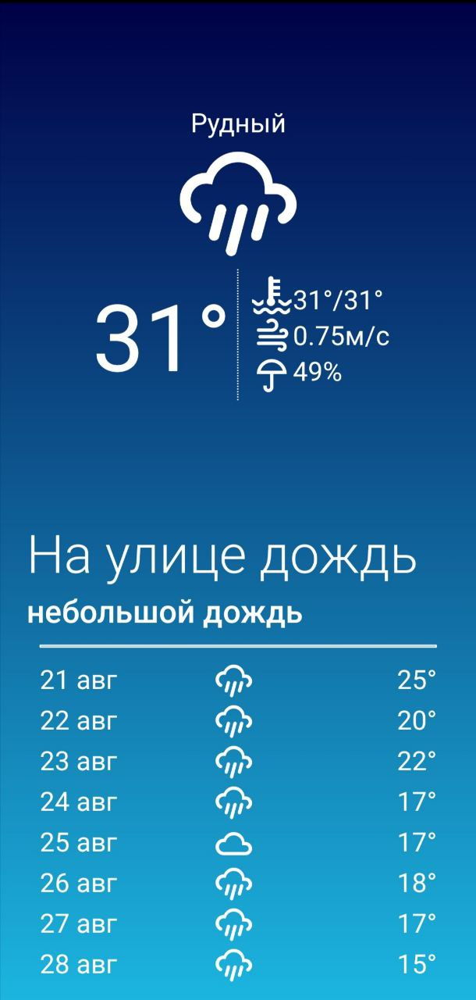

<h1 style="text-align: center;">Weather</h1>

<p align="center">
	<a href="https://reactnative.dev/"></a>
    <a href="https://expo.dev/"></a>
    <a href="https://www.ecma-international.org/publications-and-standards/standards/ecma-262/"></a>
</p>

<h2 style="text-align: center;">Приложение для просмотра прогноза погоды в Вашем городе.</h2>

<p align="center">
    
    
    
</p>

*Перед запуском приложения зарегистрируйтесь на [OpenWeatherMap](https://openweathermap.org/) и создайте бесплатный ключ API. Замените значения API_KEY в App.js на свой API ключ из [OpenWeatherMap](https://openweathermap.org/)*

## Запуск приложения
1. Клонируйте репозиторий
 ```bash
git clone https://github.com/EgorTolbaev/weatherApp.git
```
2. Установите зависимости
 ```bash
npm install
```
3. Запустите проект
-   На эмуляторе iOS
 ```bash
npm run ios
```
-   На эмуляторе Android
 ```bash
npm run android
```
-   На своем устройстве используя QR-код и Expo
 ```bash
npm start
```
